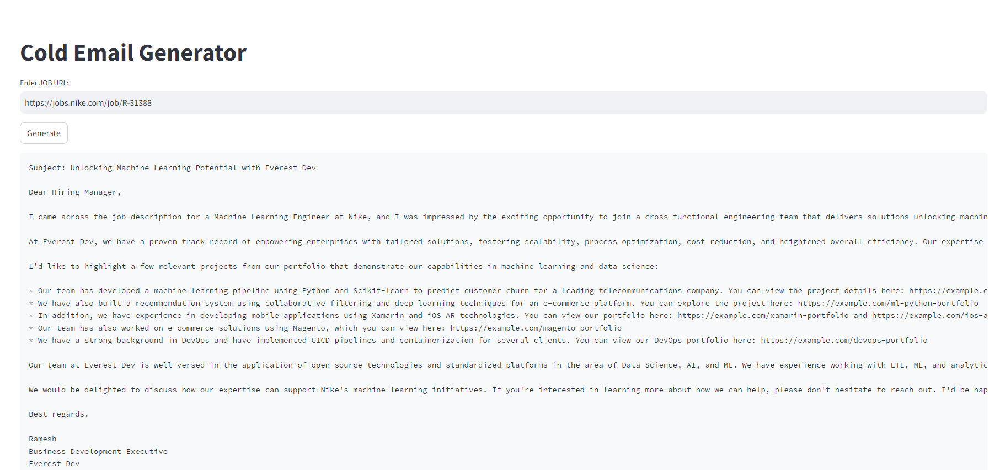

# Cold Email Generator
A tool that can be used by business development executives to approach new potential client.

Just provide the url to job description and it will generate a cold email for you.

Tools used:
1. Llama 3.1 8B
2. Langchain
3. Chromadb
4. Streamlit

## Demo
To run, 
```bash
streamlit run main.py
```

## Screenshot
